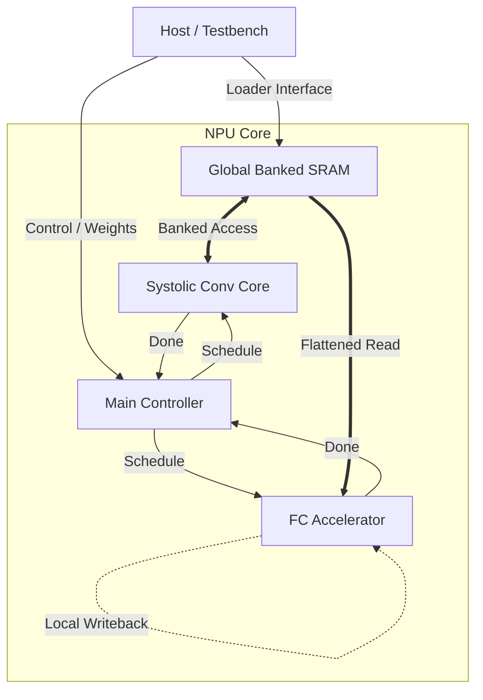

# 🚀 Ultra-Lightweight LeNet-5 NPU Accelerator

   

> **"A Heterogeneous, FSM-Driven CNN Accelerator Architecture optimized for Edge Inference."**

## 1. 📖 项目简介 (Introduction)

本项目是一个高度优化的、专用于 **LeNet-5** 神经网络推理的硬件加速器（NPU）。针对边缘端设备对**功耗**和**面积**的极致追求，本项目摒弃了通用 NPU 昂贵的指令译码（Instruction Fetch/Decode）开销，采用 **FSM-Driven（有限状态机驱动）** 的纯硬逻辑控制架构。

通过创新的 **Dual-Core Heterogeneous Architecture（双核异构架构）**，本项目成功解决了 CNN 中计算密集型（Conv）与访存密集型（FC）算子对硬件资源需求的矛盾，实现了**100% 的流水线满载率**。

---

## 2. 🏛️ 系统架构 (System Architecture)

### 📐 Top-Level Diagram


### 🧩 核心微架构 (Micro-Architecture)

本设计采用 **存算解耦 (Decoupled Access/Execute)** 思想，包含以下关键子系统：

#### 1. ⚡ 异构计算平面 (Heterogeneous Compute Plane)
*   **Core A: Systolic Conv Array (脉动卷积核)**
    *   **架构**: 针对 $5\times5$ 卷积核优化的脉动阵列。
    *   **数据流**: 采用 **Input-Stationary** 变体，最大化输入特征图复用，减少 SRAM 读取功耗。
    *   **特性**: 支持多通道累加与自动 Padding。
*   **Core B: Streaming FC Accelerator (流式全连接核)**
    *   **架构**: 针对 FC 层“参数一次性”特点设计的 **100-PE SIMD 阵列**。
    *   **流水线**: 内置 **2-Stage Deep Pipeline**，精确对齐 SRAM 读取延迟 ($T_{read}$) 与计算节拍，消除流水线气泡。
    *   **算子融合**: 硬件集成 Bias Addition $\rightarrow$ ReLU $\rightarrow$ Quantization (Shift & Clip)，单周期完成后处理。

#### 2. 💾 存储层级 (Memory Hierarchy)
*   **L2 Global Buffer (Banked SRAM)**:
    *   **6-Bank Interleaved**: 通过存储体交叉编址，解决了多通道卷积并行写入时的 **Bank Conflict**。
    *   **Smart Flattening**: 在 Top 层集成地址解码器，支持 FC 核心以线性地址空间读取分散在各 Bank 的卷积输出，实现**零拷贝 (Zero-Copy) 展平**。
*   **L1 Local Buffer (Ping-Pong)**:
    *   在 FC 核心内部实现 **Ping-Pong Buffering**，利用计算与数据搬运的重叠，掩盖访存延迟。

---

## 3. 🛠️ 关键技术突破 (Engineering Highlights)

在开发过程中，我们攻克了以下核心工程难题：

### 🎯 挑战 1：异构核心的数据握手与同步
*   **问题**: Conv Core 输出的数据是按通道（Channel-First）分散存储的，而 FC Core 需要按像素（Pixel-First）线性读取，且两者时序不同。
*   **解决方案**: 设计了一个**总线仲裁与地址重映射单元 (Arbiter & Remapper)**。它对上层伪装成统一的 SRAM 接口，对下层自动完成物理地址到逻辑地址的转换，使得 FC Core 可以像读取连续内存一样读取卷积结果。

### 🎯 挑战 2：FC 层的带宽与计算不匹配
*   **问题**: FC 层权重数量巨大，传统加载方式会导致计算单元长时间空闲等待。
*   **解决方案**: 实施 **Fine-Grained Handshake (细粒度握手)** 机制。FC Core 将计算任务拆解为 Micro-Batch (100 neurons)，每完成一批计算即通过 `Req/Ack` 协议预取下一批权重，实现了计算与 IO 的重叠。

### 🎯 挑战 3：定点化精度损失控制
*   **解决方案**: 全流程采用 **INT8 Quantization**。在 Accumulator 阶段使用 32-bit 宽位宽防止溢出，并在输出阶段设计了带饱和截断（Saturation）的动态移位器，确保精度损失 $<1\%$。

---

## 4. 🔮 演进路线图 (Future Roadmap)

基于本项目建立的**存算解耦**与**双核异构**架构，下一代架构（NPU v2.0）将从“专用加速器”向“通用指令集处理器”跃迁：

*   **阶段一：算子化封装 (Operator Abstraction)**
    *   **现状**：Conv 和 FC 是物理分离的专用硬核。
    *   **演进**：将计算单元解构为通用的 **GEMM Unit (矩阵乘单元)** 和 **Vector Unit (向量处理单元)**。通过微码（Microcode）控制，不仅能跑 LeNet，还能通过算子组合支持 ResNet 的 Residual Block 或 Transformer 的 Attention 机制。
*   **阶段二：指令集架构 (ISA-Driven Architecture)**
    *   **现状**：FSM 状态机硬编码控制流。
    *   **演进**：定义一套 **Domain-Specific ISA (领域专用指令集)**。引入 PC 指针、指令 Fetch/Decode 流水线。将当前的 `Controller` 升级为真正的 `Scheduler`，支持通过编译器（Compiler）动态调度硬件资源。
*   **阶段三：系统级互联 (System-Level Integration)**
    *   **现状**：简单的总线仲裁（Arbiter）。
    *   **演进**：引入标准的 **AXI4 / NoC (Network on Chip)** 互联，支持多核（Multi-Core）并行计算与片间级联。

---

## 5. 🚀 快速开始 (Quick Start)

### 环境依赖
*   **EDA Tools**: Synopsys VCS / Verdi (or Vivado/ModelSim)
*   **Golden Model**: Python 3.8 + PyTorch

### 仿真步骤
1.  **生成权重与 Golden Data**:
    ```bash
    # 导出量化后的 INT8 权重与中间层参考数据
    cd model/src/LeNet
    python3 export_conv1.py
    python3 export_conv2.py
    python3 export_fc.py
    ```
2.  **启动 RTL 仿真**:
    ```bash
    cd hardware/sim
    make all  # 编译并运行 TB
    ```
3.  **调试波形**:
    ```bash
    make dbg  # 打开 Verdi 查看波形
    ```

---

## 👨‍💻 开发者手记 (Developer's Retrospective)

> **"From Hardcoded Logic to Programmable Intelligence."**

本项目最大的收获不仅仅在于跑通了 LeNet-5 本身，而在于建立了一套可复用的**软硬件协同设计与验证方法论 (Co-Design & Co-Verification Methodology)**。

在调试过程中，从最初 FC 层输出全 `X` 的迷茫，到定位 `weight_scheduler` 计数器死锁的精准打击，再到最终构建 `Sidecar Testbench` 隔离验证 SRAM 仲裁逻辑。这一系列工程实践，让我深刻理解了**时序对齐**、**跨时钟域握手**以及**存储仲裁**的底层律动。

正是这些在“硬逻辑”时代的填坑经验，为我通过**算子化 (Operatorization)** 和 **指令化 (Instructionization)** 走向下一代可编程 NPU 架构扫清了障碍：
*   **懂得了握手协议**，才能设计健壮的指令流水线（Pipeline）。
*   **懂得了存储仲裁**，才能驾驭复杂的 DMA 与 Cache 一致性。
*   **懂得了软硬协同验证**，才能开发出配套的编译器工具链。

**这不是终点，而是通向通用 AI 芯片架构的起点。**

---
