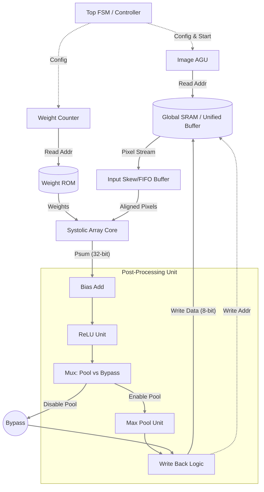

```mermaid
graph TD
    %% --- Control Plane ---
    CTRL[Top FSM / Controller]

    %% --- Memory ---
    SRAM[(Global SRAM / Unified Buffer)]
    W_ROM[(Weight ROM)]

    %% --- Address Generators ---
    AGU_IMG[Image AGU]
    AGU_W[Weight Counter]

    %% --- Compute Core ---
    INPUT_BUF[Input Skew/FIFO Buffer]
    SA[Systolic Array Core]

    %% --- Post Processing Unit (PPU) ---
    subgraph PPU [Post-Processing Unit]
        direction TB
        BIAS[Bias Add]
        RELU[ReLU Unit]
        POOL[Max Pool Unit]
        MUX_POOL[Mux: Pool vs Bypass]
        WR_LOGIC[Write Back Logic]
    end

    %% ==========================================
    %% Connections
    %% ==========================================

    %% 1. Address Generation (Control Flow)
    CTRL -.->|Config & Start| AGU_IMG
    CTRL -.->|Config| AGU_W

    %% Use standard syntax with spaces for labels
    AGU_IMG == "Read Addr" ==> SRAM
    AGU_W == "Read Addr" ==> W_ROM

    %% 2. Data Flow (Input Side)
    SRAM == "Pixel Stream" ==> INPUT_BUF
    W_ROM == "Weights" ==> SA
    INPUT_BUF == "Aligned Pixels" ==> SA

    %% 3. Compute Flow
    SA == "Psum (32-bit)" ==> BIAS

    %% 4. Post-Processing Flow (With Bypass!)
    BIAS --> RELU
    RELU --> MUX_POOL
    MUX_POOL -- "Enable Pool" --> POOL
    MUX_POOL -- "Disable Pool" --> BYPASS((Bypass))

    POOL --> WR_LOGIC
    BYPASS --> WR_LOGIC

    %% 5. Write Back
    WR_LOGIC == "Write Data (8-bit)" ==> SRAM
    WR_LOGIC -.->|Write Addr| SRAM

    %% --- Styles ---
    linkStyle default stroke-width:2px,fill:none,stroke:gray;
```
